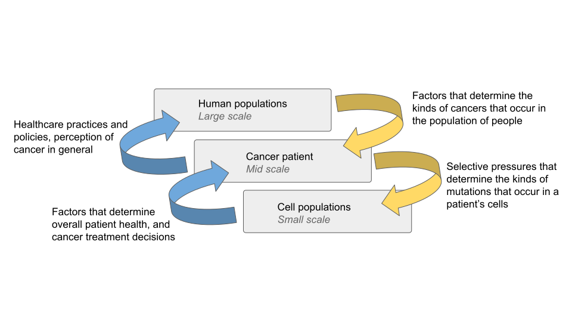
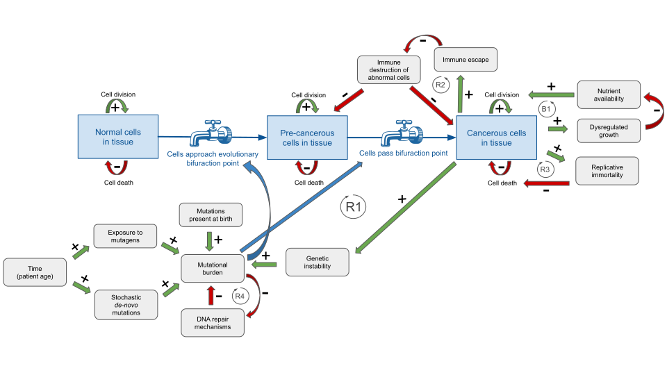

```{r, setup, include = F, echo = F}
library(plotly)
library(dplyr)
knitr::opts_chunk$set(echo = FALSE, warning = F, eval.after = 'fig.cap', fig.align='center')
knit_for_web <- rmarkdown::metadata$output$`bookdown::html_document2`$toc
```

<style>
p {font-size: 12pt;}
h1 {font-size: 20pt;}
h2 {font-size: 16pt;}
</style>


<!--
Outline

1. Background on cancer evolution 
  + How cancer evolves
  + Evolutionary fitness landscape
2. The human element: rationale for a multiscale model
  + Challenges of a multi-scale problem
  + Assumptions of each of these are necessarily reductive (as all models must be) 
  + Framework within which each of these are necessary, but limited views 
3. Methods 
  + Multiscale model (subclonal; temporal; clinical; spatial)
  + Finer-grain treatment of the small-scale setting of the multiscale model
  + leverage point analysis: treatement goals
5. Discussion
  + Cancer evolution is inevitable
  + Escaping chaotic attractors
    + Multi-targeted therapy
    + Cancer basins of attraction must be possible to revert to normal basins (attractor transition) @huang and koffman
  + Model reveals in what ways cancer is therefore not curable, as the fundamental structure of the system is not something that we have access to. Evoltion will occur regrardless.
  + However, reframing the problem in terms of stocks and flows reveals how we might "shift the balance" of cancer types and sevarities that we observe. This reframing is concordant with modern models of cancer progression. A "cure" is not a feasible expectation of oncologists, but increasing quality adjested life years might be. Treatments will ultimately always be fixes that fail, and so it is reasonable to prioritize comfortable life years over eradication of a tumour (of course, these are not necessarily mutually exclusive).
  + Self-organization (evolution) of the system is powerful, unstoppable. The leverage point analysis explains why current popular treatment approaches work, and reconcile different ideas of what the goal of cancer treatments are. 


Guidelines
Try expanding on a traditional systems analysis by considering multi-layer systems (human elements).
Heavy on the discussion section
Small amount of background, and possibly other relevant works.
Explain what you did
Choose your style based on some publication (doesn’t matter which)
Methods application
Model and analysis, results
Discussion of results
reflect on what was gained in the process of doing the study
focus on insights that came out of it
-->


# Introduction 

Cancer is a widely studied disease, and while great progress has been made in the realms of detection and treatment, there is still much lacking to our understanding of why cancer occurs and progresses in the ways that it does. Partially, this is because “cancer” is a broad term for a variety of different diseases, each with their own technicalities. However this is mostly due to the fact that cancer is a *complex disease*, meaning there are a multitude of interacting factors that influence how and why a tumour develops in a patient (@knox_omics_2010). 

One major challenge in studying cancers is within a patient, tumour cell populations are constantly evolving (@greaves_clonal_2012). New mutations accumulate in an accelerated way (@hanahan_hallmarks_2011), and evolving cells gain selective advantages over others in the same tumour. In this way, cancer cells are in competition with each other, as well as with normal cells in the body. 

Here, we will investigate several aspects of cancer evolution. As a primer, the theory of evolution will be reviewed from a systems-thinking perspective. Next, we introduce a multi-scale model of cancer evolution, which characterizes the interactions between human behavior and cancer evolution, at three different levels. Lastly, a finer-grain treatment of cancer evolution at the the tissue-level is presented, as it relates to developing cancer treatemnts, and the fundamental structure of the system that makes this endeavor problematic. 
 

## The evolutionary fitness landscape

We will apply systems thinking two fold: both to conceptualize the action of evolution on cancer cells, and to discuss the implications this has for cancer patients. Jaeger and Monk (@jaeger_bioattractors_2014) provide in-depth a conceptual framework for analyzing the systems dynamics of regulatory biological systems undergoing evolution by natural selection. In brief, there is a landscape of phenotypes that are possible to express, and depending on some initial state, an organism will achieve a certain phenotype according to a so-called "evolutionary basin of attraction". This is most simply observed in convergent evolution of biological structures. For example, both sharks and dolphins have similar body plans, but one is a fish and one is a mammal; they are developmentally very distinct. In systems terms, evolution is the action of following a trajectory through a state-space, towards a basin of attraction. It may be useful to think of evolution as acting on "the average genome" of a population, and not on any particular individual. In other words, a single cell that survives to reproduce isn't necessarily favored by evolution, it merely represents a step on the way towards a basin of attraction. 

Both the genetic profile (DNA) of a cell, and its epigenetic markers (regulatory proteins) work together to produce the phenotypic state of the cell. There are uncountably many possible combinations, giving rise to uncountably many phenotypic states. Suppose each possible phenotypic state is associated with some evolutionary fitness level. Implicitly, this results in a loss landscape that a cell can move along by changing its gene expression, and subsequently its phenotypic state. The trajectory of a cell will tend to follow the shape of this landscape, towards stable steady states. These steady states are the *attractors* in the system (@jaeger_bioattractors_2014,@weinreich_finding_2013). As with many systems, there are many possible stable states, each acting as a basin of attraction where there is low loss.  


Figure \@ref(fig:fitness-surface) visualizes this concept, as described by Waddington in 1957 (@waddington_strategy_1957). The blue ball represents a cell that may travel along various trajectories (black arrows), towards different basins of attraction. Waddington captures this as a ball rolling down a hill, from high potential to low. 

```{r, fitness-surface, fig.cap="Fitness landscape with multiple basins of attraction. Colour indicates the loss along the surface. Yellow is high loss, purple is low loss.", eval = T}
kd <- with(MASS::geyser, MASS::kde2d(duration, waiting, n = 50))
kd <- sapply(kd, function(y){x = atan(y); (x - min(x)) / (max(x) - min(x))})

ax <- list(title = "", zeroline = FALSE, showline = FALSE, 
           showticklabels = F, showgrid = FALSE)

b <- data.frame(c(0, 1), c("#000000", "#000000"))

plot_ly(x = kd$x, y = kd$y, z = -kd$z) %>% 
  add_trace(x = 0.1, y = 0.1, z = 33e-3, type = "scatter3d", mode = "markers") %>%
  add_trace(x = c(0.2, 0.5), y = c(0.15, 0.2), z = c(33e-3, 33e-3), 
            type = "scatter3d", mode = "lines", line = list(width = 4, color=I('black'))) %>%
  add_trace(x = c(0.15, 0.2), y = c(0.2, 0.5), z = c(33e-3, 33e-3), 
            type = "scatter3d", mode = "lines", line = list(width = 4, color=I('black'))) %>%
  add_trace(type="cone", x = c(0.5, 0.2), y = c(0.2, 0.5), z = c(33e-3, 33e-3), 
            u = c(45, 10), v= c(10, 45), w= c(33e-3, 33e-3), sizemode= "scale", 
            sizeref= 0.2, anchor= "tip", colorscale = b) %>%
  add_surface() %>% hide_colorbar() %>%
  layout(scene = list(camera = list(eye = list(x=-1, y=2, z=1.6)),
                      xaxis = ax, yaxis = ax, 
                      zaxis = list(title = "Fitness loss", showticklabels = FALSE)
                      ),
         showlegend = FALSE
        ) 


```
In such a system, there are points of *bifurcation*, such that after reaching a bifurcating point, a trajectory may annihilate attractor states, or have new attractor made available to it. Figure \@ref(fig:fitness-bifur) shows a toy example where if the blue cell moves out of the green region, it will become committed to either the yellow or purple basins. To put this in the probabilistic terms used by Jaeger and Monk, "The probability of observing a given phenotype in an evolving population, and its robustness against perturbations, depend directly on the size, geometry and structural stability of the associated attractor basin in phase and parameter (or genotype) space." (@jaeger_bioattractors_2014). This statement corresponds to the basins in purple region in figure \@ref(fig:fitness-bifur) being a more likely state to achieve, and together it is much more likely that the cell enters one of the yellow or purple basins, than remaining in the green region. Genetic drift is a constantly occurring phenomenon, implying that there is constant traversal of the state space by cells. This explanation is consistent with several biological observations; as a system, an evolving population is robust against small genotypic perturbations that have little impact on phenotype, as well as relatively insensitive to small environmental perturbations that have little effect on what is a "winning strategy" in terms of gene expression (@waddington_strategy_1957). A genotypic <!-- perturbation would represent a change in direction for a cell traversing the loss landscape, and a --> or environmental perturbation would correspond to a change in the shape of the landscape itself; potentially making some basins deeper or more shallow by changing the level of fitness achieved by entering that basin (expressing the phenotype). 

```{r, fitness-bifur, fig.cap="Fitness landscape with multiple basins of attraction, coloured by bifurcation potential.", eval = T}
kd <- with(MASS::geyser, MASS::kde2d(duration, waiting, n = 50))
kd <- sapply(kd, function(y){x = atan(y); (x - min(x)) / (max(x) - min(x))})
xm <- matrix(expand.grid(kd$x, kd$y)[,2], nrow = 50)
ym <- matrix(expand.grid(kd$x, kd$y)[,1], nrow = 50)

ax <- list(title = "", zeroline = FALSE, showline = FALSE, 
           showticklabels = F, showgrid = FALSE)

b <- data.frame(c(0, 1), c("#000000", "#000000"))
bifurcol <- matrix(0, nrow = 50, ncol = 50)
bifurcol[(xm < (ym)) & (xm > ym - 0.35) & (xm < 0.5) & (ym < 0.6) & (xm < 1 -ym)]  <- 0.5
bifurcol[xm >= (ym) & !((xm >= 0.55) & (ym >= 0.8))]  <- 1
bifurcol[(xm > 0.5) & (ym < 0.8) & (kd$z > 0.07)] <- 1


plot_ly(x = kd$x, y = kd$y, z = -kd$z) %>% 
  add_trace(x = 0.1, y = 0.1, z = 33e-3, type = "scatter3d", mode = "markers") %>%
  add_trace(x = c(0.2, 0.5), y = c(0.15, 0.2), z = c(33e-3, 33e-3), 
            type = "scatter3d", mode = "lines", line = list(width = 4, color=I('black'))) %>%
  add_trace(x = c(0.15, 0.2), y = c(0.2, 0.5), z = c(33e-3, 33e-3), 
            type = "scatter3d", mode = "lines", line = list(width = 4, color=I('black'))) %>%
  add_trace(type="cone", x = c(0.5, 0.2), y = c(0.2, 0.5), z = c(33e-3, 33e-3), 
            u = c(45, 10), v= c(10, 45), w= c(33e-3, 33e-3), sizemode= "scale", 
            sizeref= 0.2, anchor= "tip", colorscale = b) %>%
  add_surface(surfacecolor = bifurcol) %>% hide_colorbar() %>%
  layout(scene = list(camera = list(eye = list(x=0.9, y=1.6, z=1.8)),
                      xaxis = ax, yaxis = ax, 
                      zaxis = list(title = "Fitness loss", showticklabels = FALSE)
                      ),
         showlegend = FALSE
        ) 

```

To give a concrete example for this abstraction, consider the following scenarios for a population of cancer cells that are competing with each other for nutrient access. Each of these would have a large impact on the fitness of certain cells within the population. 

*Genetic perturbation*: A mutation in occurs in a gene that improves nutrient uptake. It is strongly selected for, and only the cells containing this mutation are efficient at competing for nutrients. Other cells die out, and the mutation rises to high frequency in the population. 

*Environmental perturbation*: a new blood vessel grows near the cells, bringing the opportunity for rich nutrient access. Only the cells that are efficient at signalling for the new growth of capillaries towards them are able to take advantage of this. These cells gain access to nutrients that let them grow quickly. Other cells grow less quickly. The expression of the beneficial signalling proteins rises to high frequency in the population. 
 
The strength of an evolutionary pressure corresponds to the depth of the basin it creates in the fitness loss landscape. In a landscape that contains many shallow basins, it is a matter of small changes to phenotype to increase fitness by a small amount, and cells may move back and forth between basins. Contrast this with a landscape consisting of deep and widely spaced basins, where escaping a basin to move to a different one may be much more unlikely, or impossible. Environmental perturbations that create new selective pressures and change the landscape is one way that cells might achieve this, even in such a landscape.

## How cancer evolves {#cancer-evol}

For most of the cells in the body, it is favourable to operate in a collaborative way, towards a holistically healthy organism. Cancer cells are subject to a different set of selective pressures than non-cancer cells, evidenced by the hallmarks of cancer (@hanahan_hallmarks_2011): resisting cell death, sustaining proliferative signalling, evading growth suppressors activating invasion and metastasis, enabling replicative immortality, inducing angiogenesis. Pre-cancerous cells are those that are following a different trajectory from non-cancerous cells. Generally, cells that aberrate from their genetic program are eliminated by the immune system. (@wu_natural_2003). Cancer cells on the other hand have been observed to escape immune elimination (@hanahan_hallmarks_2011). They may more easily progress towards an evolutionary state that causes disease. 

Cancers cells exhibit a clear fitness advantage relative to other cells, but they are not simply realizing deep basins of attraction. Cancers display qualities of a chaotic attractor (@ivancevic_theoretical_2008,@nikolov_tumors_2013,@huang_cancer_2009), meaning that they are globally stable, but locally unstable. They are sensitive to the initial state of the system, and they display fractal-like self-similarity (@nikolov_tumors_2013). These systems dynamics concepts map to biological features of cancer such as genome instability (mutations are common, but cells remain cancerous once they become so), cancer type is constrained to the cell-type-of-origin (ex. lung cancer is *necessarily* different in nature from skin cancer), and feedback loops within body systems at different levels of regulation (organ, tissue organization, cell signalling, intracellular operations) (@huang_cancer_2009).

Cancer acting as a strange attractor may help explain the level of adaptability that cancer cells exhibit. The inherent instability and improved growth of cancer cells mean that they are able to explore the fitness landscape efficiently. Natural selection works at the pace that genetic change occurs, and genomic instability lends itself readily to increasing this. 

Every cell contains the genetic instructions, and the mutations of its ancestors. In this way, we can consider the array of mutations that we observe in a tumour as a set of "genetic fossils" that give evidence of the evolutionary history of the cancer. Populations of cells with particularly advantageous mutations tend to be highly represented in the tumour because they've been positively selected for. *Tumour heterogeneity* is the degree to which cancer cells have diversified within a tumour. Different populations of cancer cells are called *subclones*, as they all originate from a common ancestor (clonal) cell population. A single tumour can display a high diversity of subclones, each with potential to evolve therapeutic resistance (@burrell_causes_2013). Indeed, high levels of heterogeneity is associated with worse clinical outcomes, and higher probability of relapse after treatment (@dagogo-jack_tumour_2018). 


# A model of multi-scale interactions {#multiscale-text}

In the context of healthcare modeling, there is often (whether explicitly or implicitly) a paradigm of linearity through time. A disease startpoint is when cancer is detected, and endpoint is when treatment is terminated, whether due to treatment success such that cancer is no longer detectable, or patient death. With the possibility in mind that cancer may be acting as a chaotic attractor however (@nikolov_tumors_2013,@valle_bounding_2018), applying this intuition may not be straightforward. For patients and healthcare teams, quality of life adjusted years of patient health is the most relevant aspect of the system. This is an outcome that is in focus at the mid-to-large scale level of the system model pictued in figure \@ref(fig:multiscale). At the small scale, understanding overall patient outcome is not as clearly meaningful, save for assuming that it is preferable to achieve a cancer that is no longer growing. An example of where it is necessary to consider this system at multiple scales is in the decision to treat a patient with chemotherapy. On one hand, chemotherapy may eliminate tumour cells. On the other hand, in certain circumstances the therapy itself can more negatively affect quality of life than the cancer itself would have if left untreated. In this case, the small-scale goal is achieved; cancer is not growing, but achieving this at the expense of the mid-scale goal of an individual's health is not an acceptable tradeoff fro the patient. 

```{r, multiscale, fig.cap = "Factors on multiple scales interact to produce the array of observable cancer profiles."}

```

However, to some extent there exists a cyclical dependency between the nature of a cancer, the treatment it receives (including leaving it untreated) and its subsequent evolution. At the small scale, this is due to a positive feedback loop in mutation accumulation. The further a tumour progresses, the more mutations it acquires, the further it progresses, etc. This concept is examined in detain in section \@ref(tissue-text). With respect to the multiscale model presented in figure \@ref(fig:multiscale), this cyclical dependency is also present, albeit more indirectly. Consider tobacco smoking-related cancers. In the 19th century, lung cancer was a rare disease (@proctor_history_2012). The rising large-scale popularity of cigarette smoking in the early 20th century meant that more individuals were smoking cigarettes (mid-scale, top yellow arrow), and more lung cells were became cancerous (small-scale, bottom yellow arrow). Studies in the 1940's and 50's established the link between smoking and lung cancer (@proctor_history_2012), and doctors acknowledged the health risk that smoking poses (mid-scale, bottom blue arrow). Despite this, lobbying and skillful advertising tactics on the part of the Tobacco industry successfully delayed the implementation of policies to control tobacco consumption (large-scale, top blue arrow). The cascading effects of mass cigarette production have had a profound impact on the world, and will continue to do so for years to come (@bammer_chapter_2007,@proctor_history_2012). Epigenetic studies that detect a footprint of genome methylation in tobacco smokers indicate that smoking alters both the genome and epigenome in heritable ways (@corley_epigenetic_2019). This means that a smoker parent can potentially pass down lung cancer predisposition to a non-smoker child, or even a non-smoker grandchild (@zakarya_epigenetic_2019). 

# An in-depth analysis at the tissue scale {#tissue-text}

Figure \@ref(fig:tissuescale) introduces a stock and flow model of cancer evolution at the tissue scale. In this model, the stocks are types of cells in a given tissue. There are three categories of cell type identified, indicated in blue squares: normal cells, pre-cancerous cells, and cancerous cells. These stocks are self-reinforcing, and maintained by cell division. When a normal cell replicates through division, it will give rise to two more normal cells, likewise pre-cancerous cells divide to yield pre-cancerous cells and cancerous cells divide to yield cancerous cells. There is a balancing factor to this, cell death. The relative rates of cell division and cell death determine whether these stocks shrink or grow. The flows in this system (faucet icon) are components that change the mutational profile or gene expression that causes transition from one cell type to another.

By construction, any model is reductive, and this view of cancer evolution is no exception. Here, the "flows" are regulated exclusively though the mutational burden of the cells (blue arrows). Mutational burden is not the sole contributor to cancer development, the influence of tumour microenvironment and immune system signaling should not be dismissed (@burrell_causes_2013, @patel_role_2010), but for the purposes of limiting the scope of this model to the evolution of mutational profiles that explore the fittness loss landscape, this modelling choice is made. 

Cancer has long been recognized to develop as a function of mutation accumulation (@temin_evolution_1988), but the sheer number of mutations a cell has is not what qualifies a cell as cancerous. Rather, what's required is that these mutations are particularly placed in genes such that normal cell functions are disrupted, but not so detrimental so as to cause cell death, as previously described in section \@ref(cancer-evol). In this case, we use "mutational burden" as a short hand for "mutational burden that allows a cancer phenotype to be expressed". In general these things are correlated regardless (@burrell_causes_2013), especially as one of the hallmarks of cancer is genome instability, meaning that mutations are more likely to occur and persist (@hanahan_hallmarks_2011). This is evident in the reinforcing loop R1 of figure \@ref(fig:tissuescale)

```{r, tissuescale, fig.cap = "A stock and flow model of cells within a tissue."}

```

Notably, most of the feedback loops coming out of cancerous cells (R1, R2, R3) are reinforcing. This reflects the fact that the cancer attractor is difficult to escape (@huang_how_2013,@li_dynamics_2016). The balancing loop B1 speaks to nutrient availability being a limiting factor to cell growth. Rapidly diving tumour cells generally consume nutrients quickly, which increases the competition between cancer cells that is observed to promote clonal evolution (@greaves_clonal_2012,@burrell_causes_2013). The reinforcing loop R4 is not generally active until later into cancer progression, but once DNA repair mechanisms are damaged within cells, mutations accumulate with distinctive patters, across the whole genome (@alexandrov_signatures_2013).

This system is arguably defined by the significant delays within it. One of the major modulators of mutational burden is time. It's only once a tumour is established that aberrant growth may occur at an accelerated pace. Accumulating the particular mutations that cause an aggressive cancer could take 30 years, and cause patient death in 3 years. Latent pre-cancerous cells are particularly difficult to identify and deal with, and this motivates further research into developing methods to discover what the exact biological criteria are to move a cell from pre-cancerous to cancerous. Certainly there are known "driver mutations" in oncogenes and tumour suppressor genes (@bailey_comprehensive_2018), but these are far from a full portrait of cancer dynamics. 

## Leverage point analysis

Meadows (@meadows_leverage_2008) defines a variety of *leverage points*, places in a system where a small change may have a large impact on the system as a whole. Most critically in the biological context is **the power of self-organization**; evolution is an example of this. Ongoing self-organization is exactly why the cancer attractor is so powerful, cancer cells have the ability to change the system, through modifying the fitness loss landscape. These changes allow new, cancerous phenotypes to "break the rules" of healthy cells, and create and fill niches that are mutually exclusive to normally functioning cells, thereby becoming a detriment to patient health. Meadows calls intervening at the point of self-organization in order to reduce diversity a push of the lever in the "wrong direction", but it is the increase in diversity that is the defining feature of a difficult to treat cancer. Adding a value judgment to the "right" or "wrong" direction to push this leverage point may be distracting from the goal that healthcare teams have: increasing quality life years for patients. 

Although changing the **constants and parameters** in the system such as doesn't subvert the basic behavior of the system, simply removing the stock of cancer cells can be highly beneficial towards improving patient outcome. For example, one treatment strategy for breat cancer is surgical removal of tumour tissue. While this doesn't necessarily prevent recurrence in some form, whether due to pre-cancerous cells that aren't eliminated progressing to cancerous, or the initial risk factors that gave rise to the cancer in the first place not being addressed, with respect to survival, lumpectomy or mastectomy can be highly effective (@cheung_treatment_2020).

Another leverage point highly relevant to our analysis is **delays in the system**. The most important structure that creates and maintain stocks of cancer cells in the system is one that we don't have access to modifying: time. As time goes on, the probability of overcoming the level of mutational burden required to progress cells from one state to another increases. If the cancer attractor is omnipresent, the best treatment strategy may indeed be finding ways to escape it. Approaches to fundamentally changing the structure of the system remain elusive, but possibly we can increase the delay between mutation accumulation and severe symptom development in order to achieve more quality life years for patients.  

Many studies have found that single-drug therapies are limited in their ability to eradicate cancer, and in fact may promote the growth of treatment-resistant cells that seed cancer relapse (@burrell_causes_2013,@tian_systems_2012,@aktipis_overlooking_2011,@wang_cancer_2013). This is most often explained as being the result tumour heterogeneity, wherein administering treatment creates a selective pressure, and while some cells may be vulnerable to this, the treatment may not be equally effective across the whole tumour, allowing a population of cancer cells to rebound and potentially even grow more efficiently when the subclonal competition is reduced. This observation has lead to the administration of multi-drug cocktails to attempt to address this problem (@dagogo-jack_tumour_2018), however this approach has many similarities to "fixes that fail" (@noauthor_fixes_2016) and does not actually change the structure of the feedback loop that promotes cancer development and growth.

Arguably, this is an example of the "wrong" direction for this intervention. An alternative proposal (@huang_how_2013, @li_dynamics_2016) with some promise is to try to redirect cancer cells towards non-cancerous basins of attraction. Indeed, in the clinical setting, up to 40% of pre-cancerous cervical cells have been observed to regress away from cancer when left untreated (@castle_evidence_2009). Huang and Koffman (@huang_how_2013) argue that it's not necessarily the case that realizing a cancer phenotype means that a cell has bifurcated away from all normal phenotypes and may never return. In reference (@huang_how_2013), the argument for cell "normalization" is made, and the authors present the reasoning that as long as a basin of attraction corresponding to normal expression have not been destroyed, a cancer cell may be coerced into returning to a normal state. This is not mutually exclusive with multi-drug cocktail approaches, in fact Huang and Koffman maintain that employing multiple drugs would be necessary to induce cell normalization. Rather, introducing the "attractor switching" perspective represents a shift in paradigm for what the goals of multi-drug approaches are. 

<!--
Suggest that although impossible to cure cancer, there are leverage points in the system; small structural changes that can have a large effect overall. As long as "cancer" as a term is used to classify aberrant growth of cells,  

Can use a systems perspective to change how cancer education is communicated. Rather than aiming to cure cancer, perhaps refocusing on harm reduction, where

-->

# Discussion

## The human element: the power of a multiscale model

Many models of cancer emphasize the importance of considering the interaction of systems that operate on different scales (@knox_omics_2010,@jaeger_bioattractors_2014,@temin_evolution_1988,@borland_tobacco_2010). Most often, this is applied by considering sub-cellular and cellular signalling together. This is a useful, but reductive scope. Cancer occurs and evolves as a function of a multitude of factors, both genetic and environmental. When modeling cancer, it is also useful to consider the impact that environmental contributors have on the probabilities of certain events. An individual that is a smoker increases their risk of developing lung cancer; they move probability density onto the event of smoking-related cancer via exposure to this risk factor. 

We are in constant interaction with our environment, and patterns in the rates of incidence across cancer types evidence corresponding patterns to the factors across different human populations that drive the contributions environment makes to different patient's cancer. UV exposure varies by latitude, chemical waste disposal varies by government policy, regularity of preventative checks for cancer varies by culture. It is impossible to not come into contact with risk factors over the course of a lifetime, but even a lack of exposure to carcinogens would produce patterns to the types of cancers that occur across a population. Of course, the genetic composition of the population also interacts with the environmental selective pressures, which also contributes to population-level variation in cancer distribution. 

One could scope a population at any level, but as an illustrative example, in America at the state level there are differences in incidence of different cancer types (@noauthor_uscs_nodate), as a result of endogenous and exogenous factors that different populations are exposed to. There are significant differences in the distributions of relative rates of different cancer types. This effect applies equally at different levels of granularity when defining a population of interest, and cancer subtypes. 

```{r, states-rates, fig.cap = "Across the states, incidence rate varies for many types of cancer. Data retrieved from [USCS](https://gis.cdc.gov/Cancer/USCS/DataViz.html)", fig.asp=1, fig.subcap=c(' ',' ',' '), out.width = ifelse(knit_for_web, "100%", "33%")}
# data retrieved from [USCS](https://gis.cdc.gov/Cancer/USCS/DataViz.html)
brain <- read.csv("brainmap.csv", quote = "'", stringsAsFactors = F)
liver <- read.csv("livermap.csv", quote = "'", stringsAsFactors = F)
lung <- read.csv("lungmap.csv", quote = "'", stringsAsFactors = F)

map_interactive <- function(data, name){
  stateLookup <- rbind(read.csv("https://raw.githubusercontent.com/plotly/datasets/master/2011_us_ag_exports.csv", 
                                stringsAsFactors = F)[,c(1:2)], c("DC", "District of Columbia"))
  data$code <- stateLookup$code[match(data$Area, stateLookup$state)]
  data$AgeAdjustedRate <- as.integer(data$AgeAdjustedRate)
  main = sprintf("%s: Rate of New Cancers per 100,000 people,<br>All Ages, All Races/Ethnicities, All Sexes", name)

  p <- plot_geo(data, locationmode = 'USA-states') %>% 
                  add_trace(z = ~AgeAdjustedRate, locations = ~code,
                  color = ~AgeAdjustedRate, colors = 'viridis', frame = ~Year, 
                  text = ~Area,
                  zmax = max(data$AgeAdjustedRate, na.rm = T), 
                  zmin = min(data$AgeAdjustedRate, na.rm = T),
                  colorbar = list(title = "Rate per 100,000"), yanchor = "top") %>%
        layout(geo = list(scope = "usa"), title = main) 
  
  return(p)
}

map_static <- function(data, name){
  # function to generate the static image version of choropleth plots
  data <- data %>% filter(Year==2017)
  stateLookup <- rbind(read.csv("https://raw.githubusercontent.com/plotly/datasets/master/2011_us_ag_exports.csv", 
                                stringsAsFactors = F)[,c(1:2)], c("DC", "District of Columbia"))
  data$code <- stateLookup$code[match(data$Area, stateLookup$state)]
  data$AgeAdjustedRate <- as.integer(data$AgeAdjustedRate)
  main = sprintf("%s: Rate of New Cancers per 100,000 people in 2017,<br>All Ages, All Races/Ethnicities, All Sexes", name)

  p <- plot_geo(data, locationmode = 'USA-states') %>% 
                  add_trace(z = ~AgeAdjustedRate, locations = ~code,
                  color = ~AgeAdjustedRate, colors = 'viridis',
                  colorbar = list(title = "Rate per 100,000"), yanchor = "top") %>% 
        layout(geo = list(scope = "usa"), title = main) 
  
  return(p)
}

if(knit_for_web){
  p1 <- map_interactive(brain, "Brain")
  p2 <- map_interactive(liver, "Liver")
  p3 <- map_interactive(lung, "Lung")
  
} else {
  p1 <- p2 <- p3 <- knitr::include_graphics(c("brain2017.png", "liver2017.png", "lung2017.png"))
}

p1; p2; p3
```

In this example, geographical differences in cancer incidence evidence the fact that there are non-random differences in these regions, and cancer evolution is occurring as some function of this. There are a multitude of potential variables involved, in addition to the examples given previously of large-scale factors that influence entire populations, every individual is affected by their personal lifestyle. 

Attempting to create a detailed and unified model of this would be challenging, but acknowledging that there are factors interacting at multiple scales allows different parties to take on the responsibility of understanding how their decision making may propagate to patterns in cancer development. This may be useful for public health initiative planning, and promoting healthy lifestyles. It is also useful for those studying cancer at a cellular or molecular level, towards accounting for elements in the systems they study that may seem like random noise, but is in fact the action of a phenomenon outside of the scope of what their field would traditionally consider. 

To this end, section \@ref(multiscale-text) provided a general overview of how players on different scales can affect patterns observed in cancer biology. It is further applicable at the tissue-level to justify research into the mutational profiles of cancers. It is possible that the signatures of mutational processes that are widely found across different cancer types are a culmination of not only the active mutation process (@alexandrov_repertoire_2020), but also environmental processes that are operating on a larger scale than the DNA base pair level. Deciphering the origin of all of these signatures remains an open research question.

The US National Cancer Institute (NCI) emphasizes the importance of applying systems thinking to produce effective measures of tobacco control, and put forward several case studies of systems approaches as applied to tobacco-related cancer (@bammer_chapter_2007). The NCI also highlights the importance of using integrated participatory methods for systems thinking to achieve their goals. Although such methods are not covered here, it is important to note that implementing change based on a systems analysis is most effective when combined with participatory methods, which can help identify practical strategies for applying control measures by engaging stakeholders such as practitioners, researchers, and policy makers. There is a much larger depth of study into systems of tobacco regulation (@borland_tobacco_2010) compared with other cancer types, primarily because the causes and potential solutions are better understood than many other cancers, but as seen in figure \@ref(fig:multiscale) in principle, systems thinking is widely applicable to integrating views of health policy, individual lifestyles, and cellular health. We can make use of a systems perspective to change how cancer education is communicated. Rather than only aiming to cure cancer, perhaps refocusing on harm reduction, and preventative strategies will become recognized as critical steps in tackling cancer on a large scale. 

## Is it impossible to cure cancer? 

Almost certainly. There are two major reasons for this. The first is simply that cancer is a large and multifactorial set of diseases. Researching complex disease is logistically challenging, in the field of cancer and beyond.

To completely eliminate cancer would require a structural change to the biological system that underlies how it occurs. There are ways that changes to policy, lifestyle, and treatment may shift the types of cancer that tend to occur most frequently but ultimately, as long as "cancer" as a term is used to classify aberrant growth of cells, there will exist a multitude of evolutionary states that are stable examples of cancer.

Indeed, cancer development seems to be a perfect example of chaos theory in action. Inopportune mutations in a single cell propagate to the growth and evolution of generations of cancer cells, ultimately creating a malignant tumour. Classic cancer treatments such as radiation therapy and chemotherapy are limited in their effectiveness both because these therapies themselves are carcinogenic, and they induce a selective pressure that promotes treatment-resistance; they are "fixes that fail" (@noauthor_fixes_2016). 

Our tissue-scale model in figure \@ref(fig:tissuescale) offers this ultimate conclusion: evolution is inevitable. Perhaps in the future, this can be exploited by setting "evolutionary traps" that target cancer cells and force them to accumulate disadvantageous mutations, as alluded to by McGranahan and Swanton (@mcgranahan_clonal_2017), but with present technology, for the most part the clinical risks of off target effects makes this difficult to implement. 

Potentially instead, moving towards a paradigm that views cancer as a result of certain system dyamics, cancer research can focus on reverting cancer cells back to a previous cell state (@knox_omics_2010). There is evidence that as cancers develop, they induce body-wide changes that create an evironment that is more favourable for their growth. The interaction of cancer cells and their environment is clearly an element of what makes them chaotic attractors in the fitness landscape (@mcgranahan_clonal_2017). The restricted, mutational view taken in the model presented in section \@ref(tissue-text) clearly falls short of "the whole story", and further research developments will inform what parts of the sytem are potentially lacking in this model, and how these impact the conclusions drawn here. 

# Conclusions

Taking a systems thinking perspective allows us to rationalize different paradigms in cancer reasearch, and promote communication across different channels of research: public health, biological, mathematical, clinical. Although rapid evolution exhibited by cancer presents unique challenges to treatment initiatives, there are also aspects to this that may be possible to exploit in developing treatmetns. Emphasis on the role of social organization on cancer incidence and disease presentation in initiatives such as the US NCI has taken against tobacco-related cancers is reveled as an important aspect to how the disease is percieved and approached. 

# References

